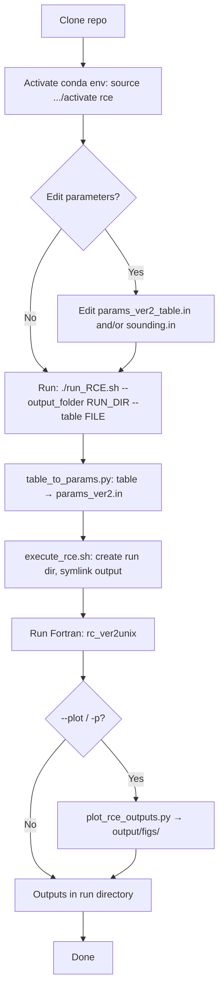

# Workflow: how to run the codebase

This diagram shows the **workflow the code follows** when you run it. As a user, you do **not** have to run all these steps yourself — you only need to activate the conda env and run `./run_RCE.sh` (and optionally edit input files). The flowchart is for **illustration and debugging** so you can see what happens under the hood.

The flow includes: **execute_rce.sh** (create run dir, symlink `output`) → **Run Fortran** (`rc_ver2unix`).
